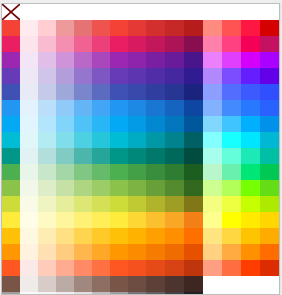
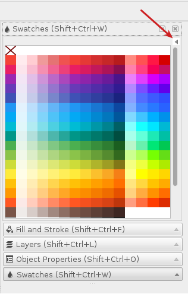

# Material Design Color Swatches for [Inkscape](https://inkscape.org)

The repository contains a file **Material-Design.gpl** with the color pallete described in the [Google Material Design Guidelines](https://www.google.com/design/spec/style/color.html#color-color-palette). The pallete follows the same order as Google's page and provides a first column with the primary (500) color and its accents colors on the same row:

## Usage

1. Download *Material-Design.gpl** file and **copy** it to the **palettes** directory of your Inkscape configuration, examples:

* **Linux:** ~/.config/inkscape/palettes/
  
* **OS X:** ~/.config/inkscape/palettes/
  
* **Windows:** %APPDATA%\inkscape\palettes\

2. Open the Swatches windoe (View -> Swatches) and select Material Design from the top right menu:

